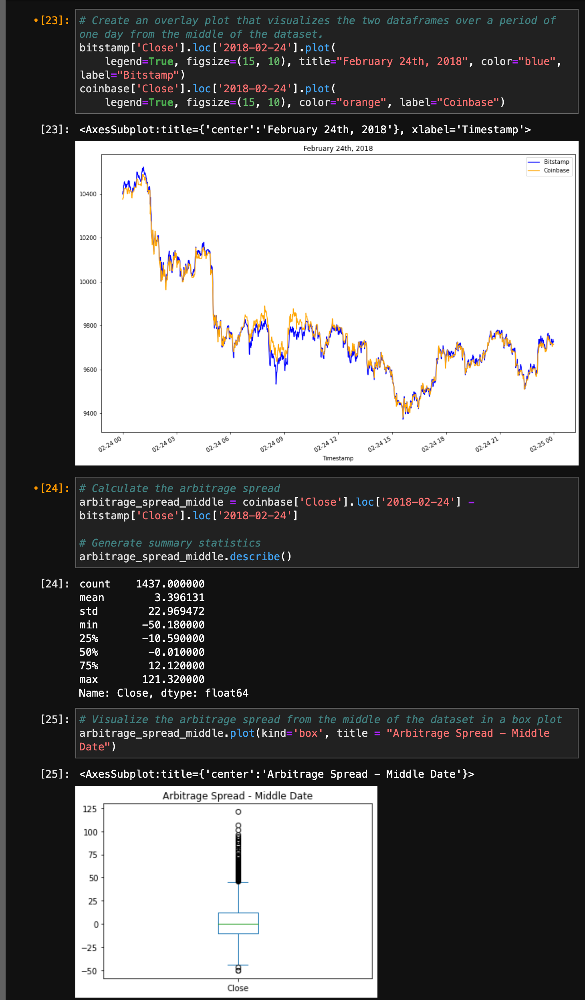

# Crypto Arbitrage

This notebook analyzes the timeseries closing price data of Bitcoin from two different exchanges to calcualte arbitrage opportunities. While manually calculating arbitrage opportunities rarely, if ever, presents meaningful results in our current system, this is a great exercise to walk through and see how one would slice, prepare, and analyze data to gather relevant results. 

---

## Technologies

This project leverages Python 3.7 with the following packages:

* [Pandas](https://pandas.pydata.org/docs/) - Data analysis and manipulation tool

* [Path](https://docs.python.org/3/library/pathlib.html) - Offers classes representing filesystem paths with semantics appropriate for different operating systems

---

## Installation Guide

Before running the application, first install the following dependencies.

```python
  pip install pandas
  pip install pathlib
```

---

## Examples

Upon running the notebook, you will see several graphics assisting in your analysis



---

## Usage

To use the arbitrage notebook, open crypto_arbitrage.ipynb in a Jupyter Lab environemnt (or other IDE with Jupyter notebook extensions):

---

## Contributors

Pull requests are welcome. For major changes, please open an issue first to discuss what you would like to change.

Please make sure to update tests as appropriate.

---

## License

N/A
